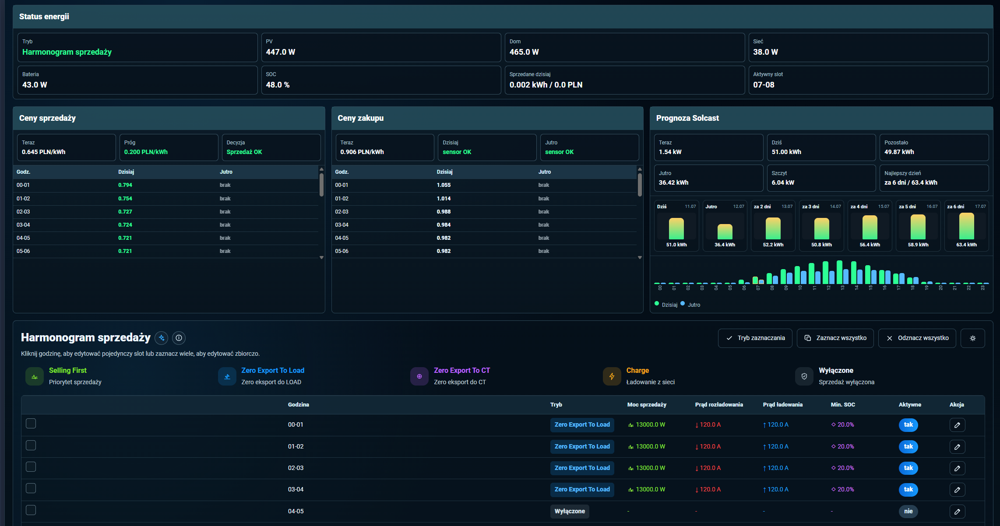
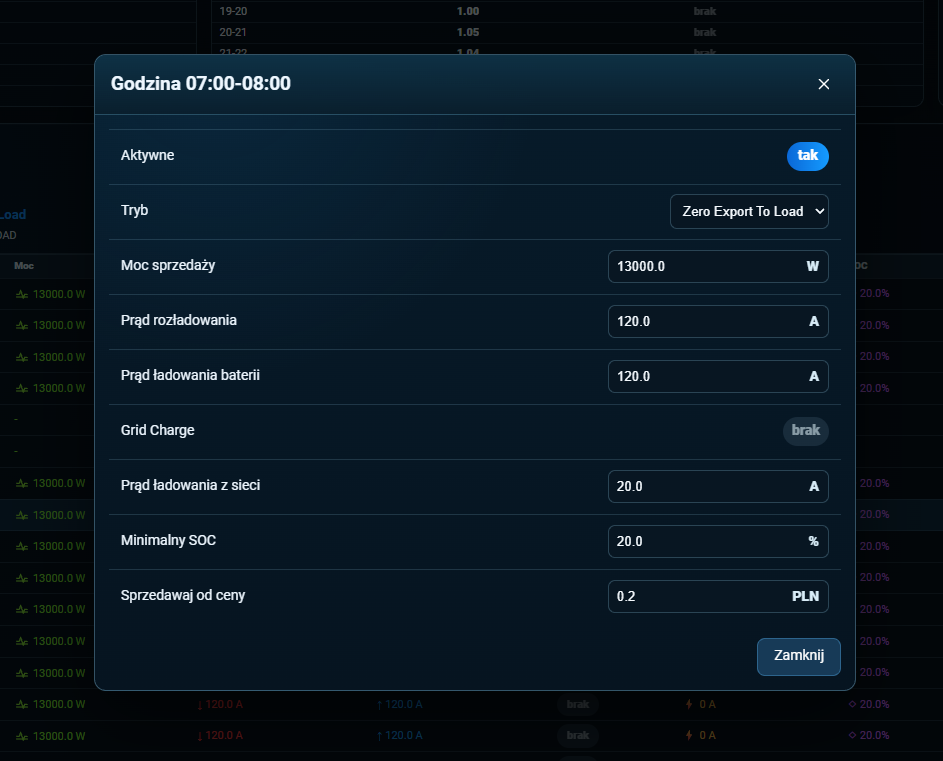
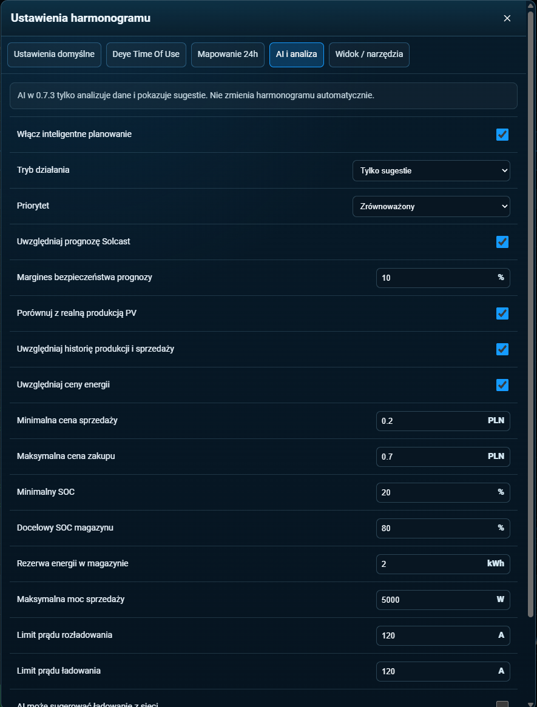

# Deye Energy Manager


[](#instalacja-przez-hacs)
[](#aktualna-wersja)
[](LICENSE)
[](#wymagane-encje)
[](https://buycoffee.to/pasierbrg)

💛 **Darmowe i open-source.** Jeśli Deye Energy Manager pomaga Ci lepiej sprzedawać energię, oszczędzać kWh albo wygodniej obsługiwać falownik Deye, możesz [postawić kawę](https://buycoffee.to/pasierbrg) ☕. To najlepszy sygnał, że warto rozwijać i utrzymywać ten projekt.

<a href="https://buycoffee.to/pasierbrg" target="_blank">
  
</a>

## Aktualna wersja

`0.7.5`

## Co robi integracja

Deye Energy Manager to integracja Home Assistant / HACS dla falowników Deye, przygotowana pod polski rynek energii. Pozwala sterować sprzedażą energii, limitami baterii, ładowaniem z sieci, prognozą Solcast, cenami Pstryk i statystykami sprzedaży z jednej karty Lovelace.

## Co dodano w 0.7.5

- Uproszczono status energii i pozostawiono najwaĹĽniejsze informacje o pracy managera.
- Przebudowano szczegóły historii analiz: czytelne godziny, ceny, SOC, moc, powód, stan zastosowania i skuteczność sugestii.
- Dodano działający `Grid Charge` dla każdego slotu godzinowego. Tryb `Charge` automatycznie włącza ładowanie z sieci i stosuje prąd oraz limit SOC slotu.
- Dodano bezpieczne mapowanie harmonogramu 24h na sześć fizycznych slotów Deye. Zbyt złożony układ nie jest zapisywany błędnie.
- Dodano natychmiastową aktualizację widoku podczas zapisu, komunikaty `Zapisywanie` i `Zapisano` oraz cofnięcie zmiany po błędzie.
- Uproszczono panele cen sprzedaży i zakupu, pozostawiając aktualną cenę oraz pełne tabele godzinowe na dziś i jutro.

## Układ dashboardu

- **Status energii** - tryb, PV, dom, sieć, bateria, SOC, sprzedane dzisiaj i aktywny slot.
- **Ceny sprzedaĹĽy** - obecna cena i kompletna tabela cen dzisiaj/jutro.
- **Ceny zakupu** - obecna cena oraz tabela cen zakupu dzisiaj/jutro.
- **Prognoza Solcast** - aktualna moc PV, prognoza dzisiaj/jutro, najlepszy dzień i wykres.
- **Harmonogram sprzedaży** - pełne 24 godziny, edycja pojedyncza i zbiorcza.
- **Statystyki sprzedaży** - obecna godzina, dzień, tydzień i miesiąc.

## Zrzuty ekranu

### Dashboard



### Edycja pojedynczego slotu



### Inteligentne planowanie i analiza



## Wymagane encje

Podstawowe encje sterujÄ…ce Deye:

```text
select.deye_inverter_system_work_mode
number.deye_inverter_max_sell_power
number.deye_inverter_maximum_battery_discharge_current
number.deye_inverter_maximum_battery_charge_current
number.deye_inverter_maximum_battery_grid_charge_current
sensor.deye_inverter_battery
sensor.deye_inverter_grid_power
```

Opcjonalne odczyty statusu Deye uĹĽywane przez dashboard:

```text
sensor.deye_inverter_pv_power
sensor.deye_inverter_load_power
sensor.deye_inverter_battery_power
```

Encje cen sprzedaĹĽy i zakupu z Pstryk AIO:

```text
sensor.pstryk_aio_obecna_cena_sprzedazy_pradu
sensor.pstryk_aio_cena_sprzedazy_pradu_jutro
sensor.pstryk_aio_obecna_cena_zakupu_pradu
sensor.pstryk_aio_cena_zakupu_pradu_jutro
```

Domyślne encje prognozy Solcast:

```text
sensor.solcast_pv_forecast_aktualna_moc
sensor.solcast_pv_forecast_prognoza_na_dzisiaj
sensor.solcast_pv_forecast_prognoza_na_jutro
sensor.solcast_pv_forecast_prognoza_na_dzien_3
sensor.solcast_pv_forecast_prognoza_na_dzien_4
sensor.solcast_pv_forecast_prognoza_na_dzien_5
sensor.solcast_pv_forecast_prognoza_na_dzien_6
sensor.solcast_pv_forecast_prognoza_na_dzien_7
sensor.solcast_pv_forecast_pozostala_prognoza_na_dzis
sensor.solcast_pv_forecast_szczytowa_moc_dzisiaj
sensor.solcast_pv_forecast_czas_szczytowej_mocy_dzisiaj
```

Encje Deye Time Of Use:

```text
time.deye_inverter_time_of_use_1_start
number.deye_inverter_time_of_use_1_soc
switch.deye_inverter_time_of_use_1_grid_charge
```

Ten sam wzĂłr jest uĹĽywany dla slotĂłw od `1` do `6`.

## Instalacja przez HACS

1. W Home Assistant otwĂłrz **HACS**.
2. WejdĹş w **Custom repositories**.
3. Dodaj repozytorium jako **Integration**.
4. Zainstaluj **Deye Energy Manager**.
5. Zrestartuj Home Assistant.
6. Przejdź do **Ustawienia → Urządzenia i usługi**.
7. Kliknij **Dodaj integracjÄ™**.
8. Wyszukaj **Deye Energy Manager** i dodaj integracjÄ™.
9. W formularzu wybierz encje swojego falownika, cen energii i Solcast.

Nie dodawaj `deye_energy_manager:` do `configuration.yaml`. Integracja działa przez UI Home Assistant.

## Dodanie karty dashboardu

Po zainstalowaniu integracji skopiuj plik:

```text
www/deye-energy-manager-card.js
```

do katalogu Home Assistant:

```text
/config/www/deye-energy-manager-card.js
```

Następnie przejdź do:

```text
Ustawienia → Panele → menu ⋮ → Zasoby
```

Dodaj nowy zasĂłb:

```text
/local/deye-energy-manager-card.js?v=0761
```

Typ zasobu:

```text
Moduł JavaScript
```

Po zapisaniu odśwież stronę Home Assistant przez `Ctrl + F5`.

Następnie otwórz wybrany dashboard i wybierz:

```text
Edytuj dashboard → Dodaj kartę → Ręcznie
```

Wklej konfiguracjÄ™:

```yaml
type: custom:deye-energy-manager-card
```

Gotowy przykład dashboardu znajduje się w katalogu:

```text
dashboard/
```

## Jak działa harmonogram

Harmonogram ma 24 osobne sloty godzinowe. Każda godzina może mieć własny tryb pracy, moc sprzedaży, prąd rozładowania, prąd ładowania baterii i minimalny SOC.

Włączenie dowolnej godziny w kolumnie **Aktywne** uruchamia sterowanie harmonogramem. Jeżeli aktualny slot jest wyłączony, integracja stosuje ustawienia domyślne.

Tryb `Charge` oznacza ładowanie z sieci. Integracja próbuje wtedy wpisać odpowiednie zakresy do 6 slotów Deye Time Of Use i zaznaczyć `Grid Charge` dla właściwych wierszy. Jeśli harmonogram 24h jest zbyt szczegółowy i nie da się go bezpiecznie zmieścić w 6 slotach Deye, integracja nie wpisuje błędnych danych i pokazuje ostrzeżenie w mapowaniu.

## Sugestie AI

Panel AI analizuje ceny sprzedaży i zakupu, prognozę Solcast, rzeczywistą produkcję PV oraz aktywne godziny harmonogramu. Ustawienia i historia analiz są przechowywane przez Home Assistant, dzięki czemu są wspólne dla telefonu i komputera.

AI przygotowuje podgląd kompletnego harmonogramu 24h z godzinami sprzedaży i ładowania. Harmonogram zostaje zapisany dopiero po ręcznym wybraniu przycisku **Zastosuj propozycję ręcznie** i potwierdzeniu operacji. Integracja kontroluje przy tym limit 6 fizycznych zakresów Deye Time Of Use.

Integracja zapisuje również prognozę Solcast i rzeczywistą produkcję z encji `sensor.deye_inverter_daily_pv_production`. Po zakończeniu dnia wylicza różnicę, błąd procentowy i trafność prognozy.

## Aktualizacja karty po zmianach

Po każdej aktualizacji karty zmień końcówkę zasobu Lovelace, np.:

```text
/local/deye-energy-manager-card.js?v=0761
```

Przy kolejnej wersji podnieś numer cache, a potem odśwież przeglądarkę przez `Ctrl + F5`.


