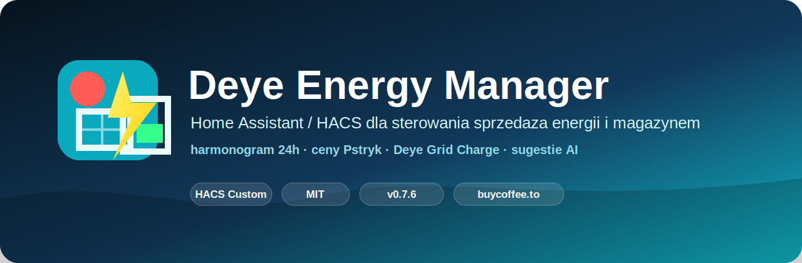

# Deye Energy Manager



[](#wersja-076)
[](#instalacja)
[](LICENSE)
[](#wymagania)

Deye Energy Manager jest niestandardową integracją Home Assistant dla falowników Deye. Łączy harmonogram sprzedaży, ochronę magazynu energii, ładowanie z sieci, ceny Pstryk, prognozę Solcast oraz statystyki w jednej karcie Lovelace.

## Wersja 0.7.6

Wersja 0.7.6 koncentruje się na bezpieczeństwie, jakości danych i wygodniejszej konfiguracji:

- brak poprawnego odczytu SOC uruchamia powrót 1:1 do pełnych „Ustawień domyślnych” zamiast przyjmować 100%;
- zapisy wielopolowe są serializowane; wartości liczbowe są zapisywane i potwierdzane przed ustawieniem wybranego trybu docelowego;
- harmonogram przekraczający 6 fizycznych zakresów Deye jest odrzucany przed aktywnym sterowaniem;
- karta stosuje operacje zbiorcze i sugestie przez jedną transakcyjną usługę backendu;
- dodano walidację trybów, mocy, prądów, SOC i cen;
- naprawiono działanie ochrony ceny i schedulera ładowania;
- dodano edycję mapowania encji w opcjach integracji;
- sensory PV, domu i baterii można mapować bez zmiany kodu;
- bieżący dzień pokazuje realizację prognozy, a nie przedwczesną „trafność”;
- trafność historyczna korzysta wyłącznie z zakończonych dni, pokazuje liczbę próbek oraz ograniczoną korektę historyczną;
- dodano pomocniczą prognozę `weather.*` (domyślnie `weather.forecast_home_2`), która ocenia ryzyko pogodowe, ale nie zastępuje Solcast;
- próbki energii są zapisywane co 5 minut; surowe dane są przechowywane 90 dni, dane godzinowe 24 miesiące, dzienne 5 lat, a miesięczne bez automatycznego usuwania;
- dodano wersjonowany katalog taryf dystrybucyjnych PGE, Tauron, Enea, Energa i Stoen, obejmujący dostępne profile gospodarstw domowych oraz profil własny;
- katalog taryf jest sprawdzany przy starcie i co 7 dni; przy błędzie pobierania integracja zachowuje ostatnią poprawną kopię, a tryb ręczny pozwala wpisać własne stawki i godziny;
- koszt dystrybucji jest doliczany przy wyborze najtańszych godzin ładowania, z uwzględnieniem pory roku, dni roboczych, weekendów i polskich świąt;
- odczyty mocy, SOC i cen aktualizują sensory managera zdarzeniowo, bez oczekiwania na minutowy cykl sterownika;
- przebudowano „Sugestie AI” na widok Dziś/Jutro z interaktywnym planem energii 24/48 h, prognozą SOC, pogodą, oceną jakości danych i trzema rzeczywiście obliczanymi wariantami;
- plan na jutro jest zapisywany jako datowany plan oczekujący i nigdy nie jest natychmiast wpisywany do powtarzalnego harmonogramu Deye;
- kreator mapowania został podzielony na Deye, ceny energii, Solcast, pogodę oraz końcowy test; wybór operatora i taryfy znajduje się w karcie;
- automatyczne mapowanie wyłącznie podpowiada encje i zawsze wymaga zatwierdzenia użytkownika;
- poprawiono bezpieczeństwo HTML, widoki mobilne i przewijanie okien;
- dodano testy regresji najważniejszych reguł bezpieczeństwa.

Pełna lista znajduje się w [CHANGELOG.md](CHANGELOG.md).

## Najważniejsze funkcje

- 24 godzinne sloty sprzedaży i ładowania;
- tryby `Selling First`, `Zero Export To Load`, `Zero Export To CT` i `Charge`;
- kompresja harmonogramu do 6 fizycznych slotów Deye Time Of Use;
- minimalny SOC i minimalna cena sprzedaży dla każdego slotu;
- ręczne i zbiorcze edytowanie harmonogramu;
- inteligentne sugestie Dziś/Jutro bazujące na cenach energii i dystrybucji, Solcast, pogodzie, SOC i wyuczonym profilu zużycia;
- automatycznie aktualizowany katalog profili dystrybucyjnych PGE, Tauron, Enea, Energa i Stoen;
- wspomaganie prognozy przez lokalną encję pogodową;
- statystyki sprzedaży, produkcji, zużycia i pracy baterii;
- diagnostyka wymaganych encji;
- eksport historii i kopii konfiguracji.

Sugestie nie są stosowane automatycznie. Użytkownik wybiera godziny i zatwierdza każdą zmianę harmonogramu.

Okno **Sugestie AI** zawiera osobne widoki: **Przegląd**, **Proponowane zmiany**, **Plan na dziś**, **Plan na jutro**, **Plan energii 48h** i **Jakość danych**. W propozycjach przełącznik **Dziś/Jutro** zmienia tabelę, wykres, pogodę, bilans i prognozę SOC. Domyślnie widoczne są tylko godziny proponowane przez model; przycisk **Pełne 24h** pokazuje cały dzień, a jeden dynamiczny przycisk przełącza funkcję **Zaznacz wszystkie/Odznacz wszystkie**. Godziny o pewności poniżej 50% nie są zaznaczane automatycznie.

Plan 48 h nie tworzy brakujących cen ani pogody. Gdy brakuje cen jutra, karta pokazuje brak danych i nie proponuje fikcyjnej transakcji. Solcast jest prognozą podstawową, a `weather.*` wyłącznie korektą pomocniczą. Przy małej historii widoczny jest stan **Wstępne uczenie** i ograniczona pewność.

Wykresy **Plan na dziś**, **Plan na jutro** i **Plan energii 48h** rozdzielają produkcję rzeczywistą, prognozę Solcast, prognozę skorygowaną oraz jej przedział. Energia korzysta z lewej osi kWh, a SOC z prawej osi procentowej. Każda godzina ma własną ikonę pogody i wskaźnik ryzyka opadów, a osobne dolne pasy pokazują sprzedaż, ładowanie i tanią dystrybucję. Legenda pozwala ukrywać serie. Wariant 48 h ma zwiększoną szerokość, poziome przewijanie i wyraźny podział dni. Szczegóły godziny są dostępne po najechaniu kursorem lub dotknięciu wykresu. Brakujące pomiary są opisane jako brak danych, a nie zastępowane zerem.

Karta pogody korzysta z wybranej encji `weather.*` (domyślnie `weather.forecast_home_2`) oraz usługi Home Assistant `weather.get_forecasts`. Pokazuje warunki bieżące, temperaturę, ciśnienie, wilgotność i wiatr oraz przełączane prognozy dzienną i godzinową. Jeżeli dostawca nie udostępnia osobnej prognozy dziennej, integracja tworzy jej podsumowanie wyłącznie z dostępnych danych godzinowych.

Przycisk **Zaplanuj wybrane na jutro** zapisuje dokładnie zaakceptowane godziny i parametry wraz z datą. Integracja nie zmienia od razu Deye Time Of Use, ponieważ jego sloty powtarzają się codziennie. Po rozpoczęciu właściwego dnia sprawdzane są encje, SOC i wymagane ceny. Poprawny plan jest zastosowany jeden raz; plan nieaktualny lub niemożliwy do bezpiecznego zastosowania jest anulowany, a integracja stosuje pełne **Ustawienia domyślne** 1:1. Integracja nigdy nie przelicza i nie stosuje samodzielnie innego planu niż zatwierdzony przez użytkownika.

## Wymagania

Wymagany jest Home Assistant `2026.6` lub nowszy.

Podstawowe encje sterujące:

```text
select.deye_inverter_system_work_mode
number.deye_inverter_max_sell_power
number.deye_inverter_maximum_battery_discharge_current
number.deye_inverter_maximum_battery_charge_current
number.deye_inverter_maximum_battery_grid_charge_current
sensor.deye_inverter_battery
sensor.deye_inverter_grid_power
```

Dla funkcji Deye Time Of Use wymagane są również:

```text
switch.deye_inverter_time_of_use
time.deye_inverter_time_of_use_1_start ... 6_start
number.deye_inverter_time_of_use_1_soc ... 6_soc
switch.deye_inverter_time_of_use_1_grid_charge ... 6_grid_charge
```

Opcjonalnie można skonfigurować sensory:

- mocy PV, domu, sieci i baterii;
- dziennej produkcji PV;
- cen sprzedaży i zakupu Pstryk;
- prognozy oraz aktualnej mocy Solcast.
- lokalnej prognozy godzinowej `weather.*`.

## Dane, trafność i uczenie

- **Realizacja dzisiaj** informuje, jaka część dzisiejszej prognozy została już wyprodukowana. Nie jest to ocena trafności.
- **Trafność historyczna** jest średnią z zamkniętych dni: `100% - bezwzględny błąd procentowy`.
- **Korekta historyczna** porównuje rzeczywistą produkcję z Solcast. Dla bezpieczeństwa pojedyncze współczynniki są ograniczone do zakresu `0,50–1,50`.
- Brakujące i niedostępne odczyty są oznaczane jako braki danych, a nie zapisywane jako sztuczne zera.
- Pogoda jest sygnałem pomocniczym. Solcast pozostaje głównym źródłem prognozy PV.

## Taryfy i dystrybucja

Operatora OSD, taryfę, źródło ceny oraz znaki przepływu ustawia się w karcie: **Ustawienia i diagnostyka → Taryfa i dystrybucja**. Zmiany zaczynają obowiązywać dopiero po użyciu przycisku **Zapisz ustawienia taryfy**. Kreator mapowania integracji służy wyłącznie do wyboru encji Home Assistant.

Tryb **Automatyczny katalog OSD** korzysta z wersjonowanego katalogu wbudowanego w integrację. Integracja sprawdza aktualizację przy starcie oraz co 7 dni, czyli kilka razy w miesiącu. Pobrane dane muszą przejść kontrolę schematu i stawek. Jeżeli serwer jest niedostępny albo plik jest nieprawidłowy, używana jest ostatnia poprawna kopia; brak kopii powoduje powrót do katalogu dostarczonego z wydaniem. Aktualizację można też uruchomić ręcznie przyciskiem **Sprawdź aktualizację katalogu**.

Zakładka pokazuje profil dystrybucji na 48 godzin — dziś i jutro — wraz ze strefą, rodzajem dnia, sezonem, stawką strefową, opłatami wspólnymi i łącznym kosztem dystrybucji. Profile obejmują sezonowe okna taryfowe, weekendy i polskie dni ustawowo wolne. AI porównuje pełny koszt zakupu dla każdej godziny dziś i jutro oraz zapisuje wyniki uczenia z oznaczeniem operatora, taryfy, strefy, rodzaju dnia, sezonu i wersji katalogu.

Jeżeli cena zakupu z wybranej encji zawiera już dystrybucję, należy włączyć opcję **Cena zakupu zawiera już dystrybucję**, aby koszt nie został doliczony drugi raz. Tryb **Ręczne stawki** pozwala wpisać własną stawkę szczytową, tanią i przedziały tanich godzin. W przypadku taryf dynamicznych wymagających osobnego sygnału integracja nie odgaduje cen ani stref i informuje o braku takiego sygnału.

Katalog jest pomocą do optymalizacji, ale przed uruchomieniem ładowania z sieci należy porównać operatora, taryfę i stawki z aktualną umową użytkownika.

Po instalacji mapowanie można zmienić przez **Ustawienia → Urządzenia i usługi → Deye Energy Manager → Konfiguruj**.

## Instalacja

### HACS

1. Otwórz HACS.
2. Dodaj repozytorium jako niestandardowe repozytorium typu **Integracja**.
3. Zainstaluj Deye Energy Manager.
4. Uruchom ponownie Home Assistant.
5. Dodaj integrację w **Ustawienia → Urządzenia i usługi**.

### Karta Lovelace

Integracja udostępnia kartę pod adresem:

```text
/deye_energy_manager/deye-energy-manager-card.js?v=0767
```

Jeżeli karta jest instalowana ręcznie, skopiuj:

```text
www/deye-energy-manager-card.js
```

do `/config/www/` i dodaj zasób:

```text
/local/deye-energy-manager-card.js?v=0767
```

Po podmianie pliku karty ustaw parametr `v=0767`, przeładuj zasoby Lovelace i wykonaj twarde odświeżenie przeglądarki (`Ctrl + F5`). `0767` jest identyfikatorem szóstej rewizji karty wydania 0.7.6. Wykres 48 h jest pokazany jako dwa czytelne wykresy dobowe bez poziomego przewijania; napisy, pogoda co godzinę i pasy statusu są renderowane poza SVG. Dla karty udostępnianej przez integrację używaj adresu `/deye_energy_manager/...`; adres `/local/...` jest przeznaczony wyłącznie dla pliku skopiowanego ręcznie do `/config/www/`.

Konfiguracja karty:

```yaml
type: custom:deye-energy-manager-card
```

Przykład kompletnego dashboardu znajduje się w `dashboard/energy_manager.yaml`.

## Zasady bezpieczeństwa

- Przy aktywnej ochronie SOC brak poprawnego odczytu baterii uruchamia powrót 1:1 do pełnych **Ustawień domyślnych**.
- Przy aktywnej ochronie ceny brak poprawnej ceny uruchamia powrót 1:1 do pełnych **Ustawień domyślnych**.
- Aktualizacja ustawień zapisuje i potwierdza wartości liczbowe przed ustawieniem docelowego trybu falownika; integracja nie zastępuje wybranego trybu innym.
- Mapowanie ponad 6 zakresów nie jest zapisywane do Deye.
- Ustawienia zapisane w oknie **Ustawienia domyślne** są stanem powrotu po zatrzymaniu lub błędzie.
- Stop Sell, zatrzymanie awaryjne oraz błędy SOC, ceny, mapowania i zapisu stosują 1:1 domyślny tryb, domyślną moc oraz trzy domyślne prądy użytkownika. Integracja nie zapisuje automatycznie wartości `0`, chyba że użytkownik sam zapisał ją jako domyślną.
- Integracja zachowuje `Zero Export To CT`, `Zero Export To Load` albo `Selling First` dokładnie zgodnie z wyborem użytkownika i nie odgaduje topologii instalacji.
- Stop Sell i zatrzymanie awaryjne zatrzaskują sterowanie managera do świadomego wznowienia oraz stosują pełny zestaw ustawień domyślnych użytkownika.
- W **System i diagnostyka** przycisk **Włącz Manager i harmonogram** świadomie przywraca tryb `Schedule` i włącza Scheduler. Nie włącza osobnego harmonogramu ładowania z sieci. Diagnostyka pokazuje ostatnią próbę zastosowania slotu, wartości oczekiwane i odczytane oraz stan encji Deye Time Of Use.
- W **System i diagnostyka** przycisk **Włącz Manager i harmonogram** świadomie przywraca tryb `Schedule` i włącza Scheduler. Nie włącza osobnego harmonogramu ładowania z sieci. Diagnostyka pokazuje ostatnią próbę zastosowania slotu, wartości oczekiwane i odczytane oraz stan encji Deye Time Of Use.
- Ustawienia można ręcznie przywrócić przyciskiem **Zastosuj ustawienia domyślne teraz**.

Integracja steruje fizycznym urządzeniem. Pierwszą konfigurację należy obserwować w Home Assistant i aplikacji falownika, używając konserwatywnych limitów mocy i prądu.

## Testy

Testy logiki bezpieczeństwa nie wymagają instalacji Home Assistant:

```text
python -m unittest discover -s tests -v
```

## Licencja

Projekt jest udostępniany na licencji MIT. Szczegóły: [LICENSE](LICENSE).

Rozwój projektu można wesprzeć przez [buycoffee.to](https://buycoffee.to/pasierbrg).
